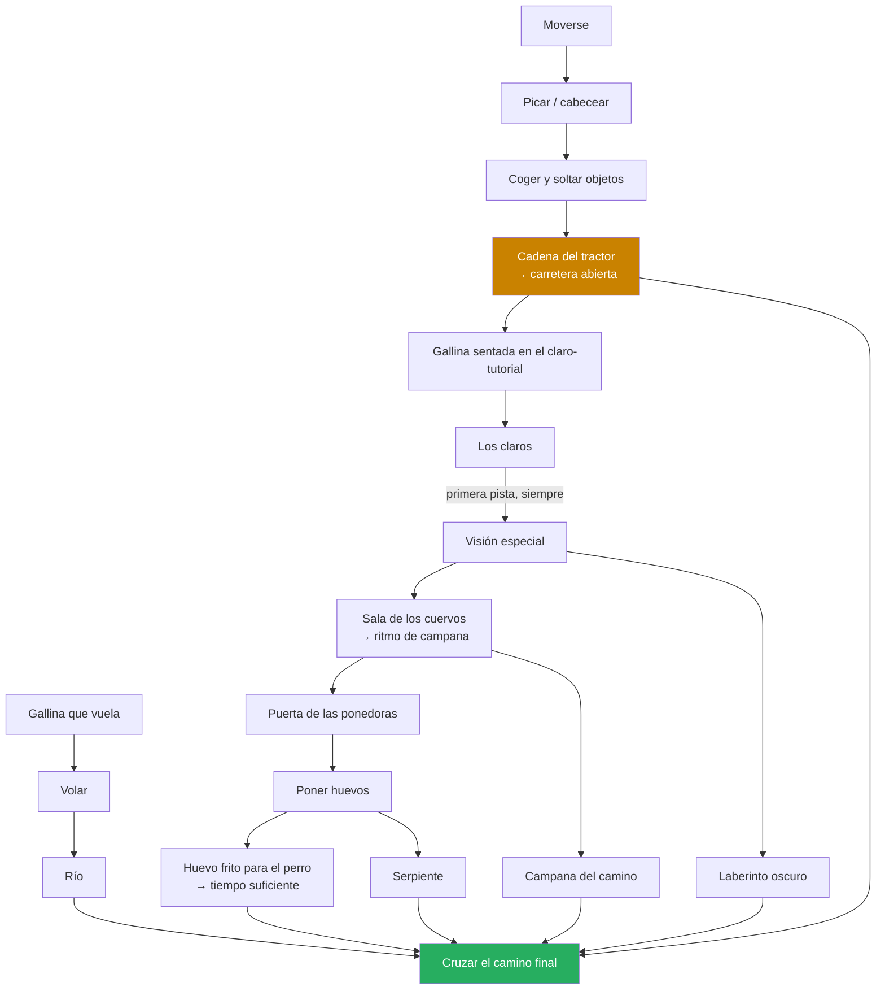

# 05 — Progresión: el grafo de conocimiento

En este juego **el jugador es el inventario**. Lo que sigue no es un árbol de
desbloqueos: es el orden en que el jugador puede *enterarse* de las cosas.

## Grafo actual



## Lo que dice el grafo

**El tractor es la puerta de todo.** Como el claro-tutorial está nada más cruzar
la carretera, el jugador no puede aprender *nada* de la cadena larga —ni claros,
ni visión, ni ritmo, ni huevos— hasta que el tractor se estrella. Ya no hay dos
ramas en paralelo: hay un **prólogo obligatorio** (picar → coger → tractor) y
después todo lo demás.

Prólogo de **una sola vez en toda la partida**, no de cada run: el tractor es un
puzzle de estado, y una vez estrellado la carretera queda abierta para siempre.

Lo bueno y lo malo de eso:

- **A favor**: el juego tiene un arranque limpio y sin ambigüedad. Todo el mundo
  vive la misma primera media hora, la dificultad está controlada, y la cadena
  del tractor es un puzzle que se resuelve solo con lo que el jugador ya sabe
  (picar y coger), así que es un buen tutorial encubierto.
- **En contra**: quien se atasque en el tractor no ve *nada* del juego. Antes la
  rama corta era el plan B del jugador perdido; ahora es el único camino. Todo
  el riesgo de abandono se concentra en un solo puzzle de cuatro pasos.

**Después del tractor, la cadena sigue siendo larga**: gallina sentada → claro →
visión → cuervos/ritmo → ponedoras → huevos → (perro + serpiente). Cada eslabón
que no se entienda esconde todo lo que viene detrás, así que la redundancia vale
más al principio de la cadena que al final.

**Ya no queda ningún nodo sin maestro.** Volar lo enseña otra gallina, que se ve
mover la cabeza muy rápido y despegar. Con eso, el grafo está completo: todo lo
que el jugador tiene que aprender tiene a alguien que se lo enseña o un claro
que se lo dice.

## ¿Cuántas pistas hacen falta?

La duda era si cinco pistas bastan o si el diseño pide veinte. Contando lo que
realmente necesita enseñanza y quitando lo que ya tiene maestro propio:

| Qué hay que aprender | Quién lo enseña | ¿Necesita pista de claro? |
| --- | --- | --- |
| Picar, coger y soltar | Prueba y error | No |
| Los claros | La gallina sentada | No |
| **La visión especial** | **El claro-tutorial** | **Sí — pista 1, fija** |
| El ritmo de campana | Los dos cuervos | No |
| Poner huevos | Las ponedoras | No |
| Volar | La gallina que vuela | No |
| Que las zonas calientes fríen huevos | Nadie | Candidata — pista 2 |
| Que al perro se le puede dar de comer | Nadie | Candidata — pista 3 |
| Que la serpiente se aparta con un huevo | Nadie | Candidata — pista 4 |

**Salen cuatro.** Ni de lejos veinte: casi todas las mecánicas tienen maestro
vivo y esas no gastan pista. Con cuatro, «cada claro tiene la suya» sale a **un
claro abierto + tres medio cerrados**, y queda margen por si en playtest hace
falta alguna más.

## El patrón que ha salido solo

Mirando quién enseña qué, el reparto no es arbitrario:

| Tipo de cosa | Quién la enseña | Por qué |
| --- | --- | --- |
| **Gestos** (volar, huevos, ritmo, claros) | Un bicho haciéndolo delante de ti | Se ven desde fuera |
| **La visión especial** | Un claro | Es lo único que **no** se ve desde fuera: pasa dentro de la gallina |
| **Usos** (freír, dar de comer, la serpiente) | Un claro | No son una habilidad, son una idea |

O sea: **si la mecánica se ve, la enseña un bicho; si no se ve, la enseña un
claro.** La visión especial es la excepción de la primera columna justamente
porque no hay forma de que otra gallina te enseñe a ver.

Regla práctica para no inflar la lista de pistas: **si aparece algo nuevo que
pediría pista, la primera pregunta es si se puede ver desde fuera.** Si se puede,
va con maestro; si no, gasta pista.

## Orden esperado en una partida

| Fase | Descubre | Cómo |
| --- | --- | --- |
| 0 | Moverse y cabecear | Le has dicho el botón |
| 1 | Picar cosas, coger cosas | Prueba y error cerca de objetos |
| 2 | Existe un tiempo y un perro | La cadena de la UI se rompe |
| 3 | Cadena del tractor | Botón → llaves → tractor → carretera |
| 4 | Los claros | Gallina sentada nada más cruzar la carretera |
| 5 | **La visión especial** | Primera pista del claro-tutorial |
| 6 | El ritmo de la campana | Los dos cuervos, en la sala oscura |
| 7 | Poner huevos | Las ponedoras, tras abrir la puerta con el cuervo |
| 8 | Volar | La gallina que vuela, moviendo la cabeza muy rápido |
| 9 | Hay que alimentar al perro | Se queda sin tiempo a mitad del camino final |
| 10 | Run limpia | Escapa |

**Estas fases no son una ruta, son partidas distintas.** El juego no pide ir y
volver dentro de una misma run: pide aprender y reiniciar. Una run sirve para
descubrir una cosa; cuando el perro te caza, vuelves a empezar sabiéndola.

De ahí sale una regla que conviene tener presente al montar el mapa:

> **Cada maestro se visita una vez en toda la partida, no una vez por run.**
> Cuando los cuervos te han enseñado el ritmo, la sala de los cuervos ya no
> vuelve a hacer falta nunca. Lo mismo con las ponedoras y con la gallina
> sentada.

Es decir, que los sitios que enseñan son de **un solo uso**: después se
convierten en paisaje. No hay que dimensionar el tiempo del perro para que quepa
"ir al bosque y volver a la granja en la misma run" — cada descubrimiento puede
costar su propia run, y eso es el juego funcionando, no un fallo.

## Antesalas: el gating

Para llegar al puzzle que enseña la mecánica **B** hay que usar antes la
mecánica **A**. Cómo está la cadena hoy:

```
picar+coger ──▶ [el tractor]        ──▶ aprende CLAROS y VISIÓN
visión      ──▶ [la sala a oscuras] ──▶ aprende RITMO
ritmo       ──▶ [la puerta cerrada] ──▶ aprende HUEVOS
```

Los tres eslabones están puestos. El claro-tutorial es el único sitio que **no**
lleva antesala propia: su antesala es la carretera.

**Regla de oro contra la circularidad.** Nunca poner de antesala a un
puzzle-que-enseña una mecánica que solo se aprende detrás de él. Aplicada a los
claros medio cerrados: **ningún claro puede estar cerrado detrás de la mecánica
que ese claro enseña**. Un claro que da la pista de volar no puede estar al otro
lado del río; uno que explica las zonas calientes sí puede pedir visión, porque
la visión ya se aprendió en el claro-tutorial.
